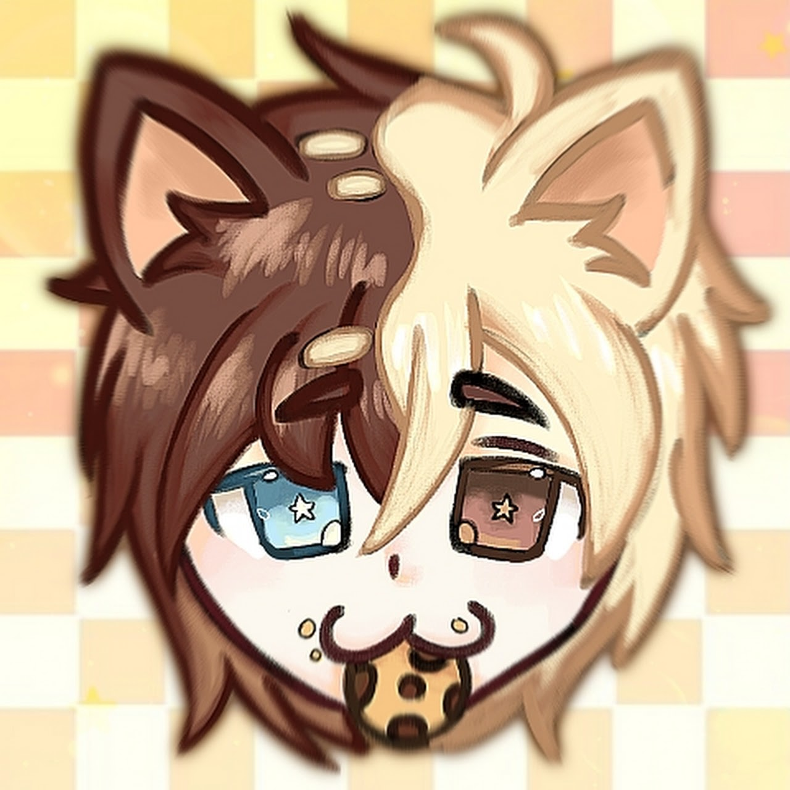

## 🤍 Special Thanks To:

---

### 🧠 Core

<table>
  <tr>
    <td align="center">
      
       
      <strong>Noa</strong>
       
      Creator • Developer
       
      <a href="https://github.com/noadevbr">GitHub</a>
    </td>
    <td align="center">
      
       
      <strong>Bryan — Leref</strong>
       
      Developer • Sub-creator
       
      <a href="https://github.com/bryansmithsantos">GitHub</a>
    </td>
  </tr>
</table>

---

### 🤝 Support & Collaboration

<table>
  <tr>
    <td align="center">
      
       
      <strong>Aaron — Gatifula</strong>
       
      Beta • Support
       
      <a href="https://github.com/gatifulaa">GitHub</a>
    </td>
    <td align="center">
      
       
      <strong>Thaís — Op3ny</strong>
       
      Integration with the Hsyst Ecosystem • Support
       
      <a href="https://github.com/op3ny">GitHub</a>
    </td>
  </tr>
</table>

---

### 🎨 Artwork

<table>
  <tr>
    <td align="center">
      
       
      <strong>Matheus — Kukie</strong>
       
      Koxik Artwork
    </td>
  </tr>
</table>

---

## 🧠 About

**KTT (Koxik Thanks To)** exists to make explicit what many projects fail to show: **people**.

Here:
- creators are visible  
- supporters are visible  
- artists are visible  

---

## Why this branch exists
- People are not footnotes  
- Acknowledgement is also infrastructure  
- A project should recognize those who sustain it
